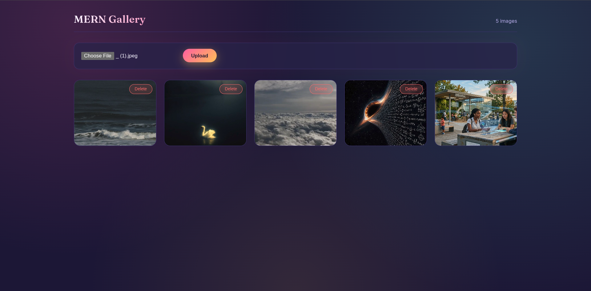
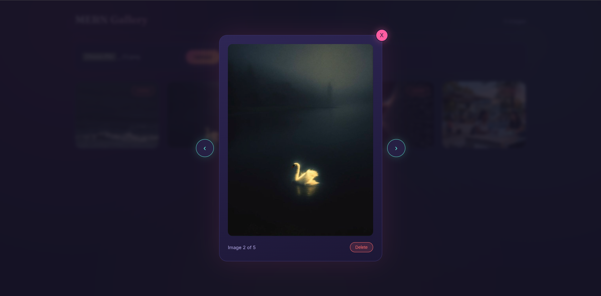

<div align="center">


<p>A full-stack image gallery built with React, Express, MongoDB, and Multer.</p>

</div>

## Features

- Upload images through a responsive React interface
- Store uploaded files locally in the backend `uploads` directory
- Browse images in a responsive gallery grid
- Open images in a full-size viewer
- Navigate between images with Previous and Next controls
- Delete images from MongoDB and local storage

## Screenshots

### Empty Gallery

Upload prompt shown when no images exist.


### Gallery View

Uploaded images displayed in a responsive grid.



### Image Viewer

Full-size image viewer with navigation and delete controls.



### Live View

https://github.com/user-attachments/assets/4af28854-75e1-4e4d-bf98-cc204b498f17

## Technologies

### Frontend

- React 18
- Vite
- JavaScript
- CSS
- Axios

### Backend

- Node.js
- Express.js
- MongoDB
- Mongoose
- Multer
- CORS
- dotenv

## Project Structure

```text
mern-gallery/
├── client/
│   ├── src/
│   │   ├── components/
│   │   │   ├── Gallery.jsx
│   │   │   ├── UploadForm.jsx
│   │   │   └── Viewer.jsx
│   │   ├── App.jsx
│   │   ├── api.js
│   │   ├── index.css
│   │   └── main.jsx
│   ├── .env.example
│   ├── package.json
│   └── vite.config.js
├── server/
│   ├── middleware/upload.js
│   ├── models/Image.js
│   ├── routes/imageRoutes.js
│   ├── uploads/
│   ├── .env.example
│   ├── package.json
│   └── server.js
└── README.md
```

## Backend Setup

### 1. Install dependencies

```bash
cd server
npm install
```

### 2. Configure environment variables

Create `server/.env` from the example file:

```bash
cp .env.example .env
```

Set the values for your MongoDB instance:

```env
PORT=5000
MONGO_URI=mongodb://127.0.0.1:27017/gallery
BASE_URL=http://localhost:5000
```

### 3. Start the backend

```bash
npm run dev
```

The API runs at `http://localhost:5000`.

## Frontend Setup

Open a second terminal:

```bash
cd client
npm install
cp .env.example .env
npm run dev
```

The Vite development server runs at `http://localhost:5173`.

The frontend environment file should contain:

```env
VITE_API_URL=http://localhost:5000/api
```

## API Endpoints

| Method | Endpoint | Description |
| --- | --- | --- |
| `GET` | `/api/images` | Get all uploaded images |
| `POST` | `/api/images` | Upload an image using the `image` form field |
| `DELETE` | `/api/images/:id` | Delete an image and its local file |

Uploaded files are served publicly from:

```text
http://localhost:5000/uploads/<filename>
```

## Storage

Images are stored locally in `server/uploads`. MongoDB stores the public URL for each image, while Express serves the uploaded files through its static files middleware.

## Author

**Atiba Younus**

Computer Science Student | MERN Stack Learner
